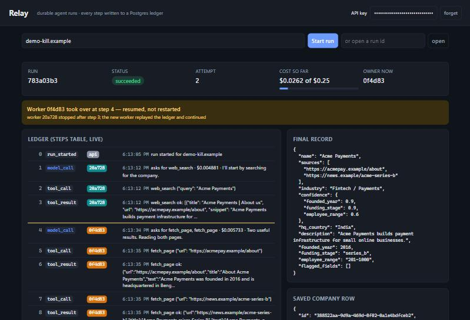

# Demo page — watch a run live, kill a worker, see it resume

## 1. The picture

Everything Relay does is already in the ledger, but a table of rows in a
terminal doesn't make a demo. The demo page is a window onto the `steps` table:
you start a run, watch each step arrive, kill the worker that owns it, and see a
different worker pick up at the next step.

**Analogy:** the departures board at a station. The board doesn't run the
trains; it only reads the timetable database every few seconds and shows what
changed. The page is the same: it never talks to workers, it only asks the API
"what's in the ledger now?" once a second.

## 2. Runtime story (run `783a03b3`, the screenshot above)

| Time | What you do / what happens | What the page shows |
|---|---|---|
| 0 s | paste the API key, type a domain, **Start run** | `POST /v1/runs` → the page gets a run id, puts it in the URL (`#run=…`) |
| every 1 s | the page calls `GET /v1/runs/{id}` and `GET /v1/runs/{id}/steps` | status, attempt, cost vs budget, owner; new ledger rows appear with a worker badge |
| ~7 s | worker `20a728` has written steps 1–3 | "To test a crash: `docker kill 20a728e01dc2`" |
| — | run that command in a terminal | nothing new for ~15 s: the lease is running out |
| ~29 s | worker `0f4d83` claims (attempt 2), replays, writes step 4 | yellow banner: **"Worker 0f4d83 took over at step 4 — resumed, not restarted"**; a divider above step 4; new badge colour |
| ~45 s | `final`, status `succeeded` | polling stops; final record and the saved company row appear |

## 3. Design decisions

| Choice | Alternative | Why |
|---|---|---|
| One static `index.html`, served by the same FastAPI app at `GET /` | React / a build step / a separate server | The page is a form and a list. No npm, no build, one file to read |
| Polling every 1 s | SSE (live push) | The decided simple version; a run has at most ~15 rows, so re-reading all steps each second is cheap. SSE is backfill item 10 |
| `GET /v1/runs/{id}/steps` returns a **short summary** per row (≤ 140 chars) | Send the full payloads | Page texts can be long; the page only needs a glance. Scoped to the tenant like `GET /v1/runs/{id}` |
| New `GET /v1/companies/{domain}` | Put the company inside the run response | The company belongs to a domain, not a run (several runs can refresh one row) |
| The key is typed into the page, kept in memory, optionally remembered in `localStorage` (wrapped in `try`), "forget" button | Put the key in the HTML | The HTML is public once deployed; a key inside it would be a key for everyone |
| Everything from the API is inserted with `textContent`, never as HTML | `innerHTML` | Summaries contain text from web pages, which is untrusted: `innerHTML` would let a page run script in the viewer's browser |
| Worker names are the container id's first 6 characters, with a colour per worker in order of appearance | Map to `relay-worker-1/2/3` | The API can't see Docker; the id is what's in `written_by`, and `docker kill` accepts it |
| Takeover = the writer changes between two worker-written steps | Compare with `attempt_count` | It's computed from the ledger itself, so the banner shows exactly where the handover happened |
| The page shows the exact `docker kill <id>` for the current owner | Ask the viewer to find the container | It makes the demo a copy and paste, which is good for a recording |
| Run id in the URL fragment (`#run=…`) | Nothing | A refresh reopens the same run; ids aren't secret. The key never goes in the URL |

## 4. Crash walk

The page holds no state that matters. If the **browser** closes, the run
continues; reopen `http://127.0.0.1:8001/#run=<id>`. If the **API** restarts,
polling shows an error line and recovers on the next successful request. If a
**worker** dies, the page is the thing showing it.

## 5. The proof

Setup: 3 worker containers, `FAKE_DELAY_SECONDS=5` and `LEASE_SECONDS=15` during
the test (delay removed afterwards). To avoid using the real key, the test ran
against a second copy of the API on port 8002, started with a throwaway key
created for the test (and deleted after).

| Check | Predicted | Happened |
|---|---|---|
| Start with no key | "API key missing or wrong" message | ✅ |
| Page HTML contains a key | no | ✅ none |
| `/v1/...` without a key | 401 | ✅ |
| Start with the key, kill the owner after step 3 (`docker kill 20a728e01dc2`, copied from the page) | banner "took over at step 4", attempt 2, succeeded, company row shown | ✅ run `783a03b3`: banner "Worker 0f4d83 took over at step 4 — resumed, not restarted", attempt 2, `succeeded`, 14 steps, cost $0.0262 of $0.25, company row for `demo-kill.example` |
| `scripts/check_run.py 783a03b3…` | OK | ✅ 14 steps, 4 `model_call`, no gaps |
| Browser console | no errors except the deliberate 401 | ✅ |

## 6. How to record the demo yourself

1. **COMMANDS terminal:** add the delay so the run is slow enough to kill:
   `Add-Content .env "FAKE_DELAY_SECONDS=5"`, then `docker compose up -d --build worker`
2. **API terminal:** `uvicorn relay.api.main:app --reload --port 8001`
3. Open `http://127.0.0.1:8001`, paste your key in the top right, type a domain, **Start run**.
4. After 3–4 steps, copy the `docker kill …` line the page shows and run it in the COMMANDS terminal.
5. Wait ~15–20 s for the takeover banner, then the final record.
6. Afterwards remove the `FAKE_DELAY_SECONDS=5` line from `.env`, rebuild, and `docker compose stop worker`.

## 7. Questions for Yamini

1. Why does the page poll instead of the server pushing updates?
2. Why is the API key never written into `index.html`?
3. Why `textContent` and not `innerHTML` for step summaries?
4. How does the page decide that a takeover happened, and why not from `attempt_count`?
5. What happens to the run if you close the browser tab halfway through?
6. Why does the steps endpoint send summaries instead of full payloads?

Answers

1. Polling is the simplest thing that looks live: one request a second, no
   open connections, nothing to reconnect. A run has so few rows that
   re-reading them all is cheap. SSE is a later add-on.
2. The HTML is served to anyone who opens the URL. A key inside it would be
   everyone's key, so the viewer types their own.
3. Summaries include text from fetched web pages, which is untrusted. As HTML, a
   page could inject a script into the viewer's browser; `textContent` always
   shows it as plain text.
4. It walks the ledger and flags the first step whose `written_by` differs from
   the previous worker-written step. That shows *where* the handover happened;
   `attempt_count` only says *that* it happened.
5. Nothing: the page only reads. The worker keeps going; reopen the URL with
   `#run=<id>` to watch again.
6. Page texts can be kilobytes, and the page only needs one line per step. Less
   data per poll and nothing large sent to the browser.

## 8. Interview lines

- "The demo page is one static HTML file that polls the ledger once a second.
  When I kill the worker that owns a run, the page shows another worker taking
  over at the next step number."
- "The page never talks to workers: API and workers only meet in Postgres, so the
  UI is just another reader of the ledger."
- "Everything from the ledger is rendered as text, never HTML, because tool
  output is untrusted web content."
